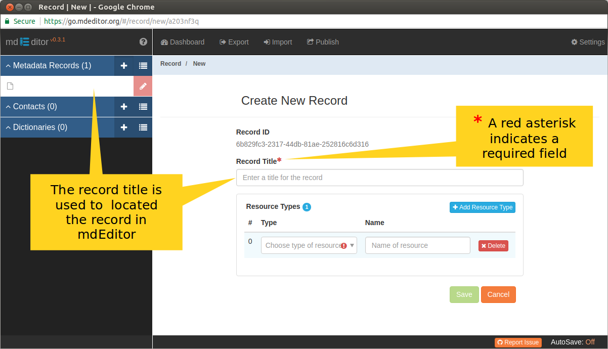

### Add a New Metadata Record
---
 Click the plus (+) button on the left menu-bar next to 'Metadata Records' to create a new metadata record.  The same behavior applies to 'Contacts' and 'Dictionaries' which we will create later.  For now just add a new metadata record. 


You should see something like this ...



The 'Create New Record' panel collects the minimal information mdEditor requires to place an new metadata record in browser cache and find it again.  This minimal information is, of course, not sufficient to meet the minimum of any metadata standard, but just enough that you and mdEditor can find it for editing.  

  Record ID (reqired) - Notice that mdEditor has filled in a Record ID for you.  By default mdEditor assigns a [UUID](https://tools.ietf.org/html/rfc4122) (Universally Unique Identifier) as the Record ID.  You may change this identifier if you like; but it must be unique among the all your metadata records otherwise there may be some confusion with record links later on when using more advanced mdEditor feature.  If you have a reliable record identification system, use it, otherwise best to keep the UUID.  
```
Let's leave the Record ID as the UUID for now, it can always change it later if you choose.  
```

 Record Title (required) - This is the name you assign to the main resource described by this metadata record.  In addition to becoming part of your metadata record, the name will be used in the left menu-bar to identify your record . 
```
Enter your Record Title.
```  
>  Notice the record title appears in the left menu-bar as you type the name in the edit panel.  The left menu-bar is where you will find and gain access to this record when want to continue editing. 

 Resource Types (required) - Choose a resource type for the main resource described by this metadata record.  You may optionally provide a name for the resource.  
```
Enter a Resource Type and Resource Name.
```
>  Notice the Resource Type block as a ' + Add Resource Type' button.  Click this button to enter another resource type in cases when the resource has been represented in multiple formats such as 'tabularDataset' and 'map'. 

 We are ready to save the metadata record.  The 'Save' button at the bottom of the panel should have become active and turned a darker shade of green.  
```
Click the Save button.
```